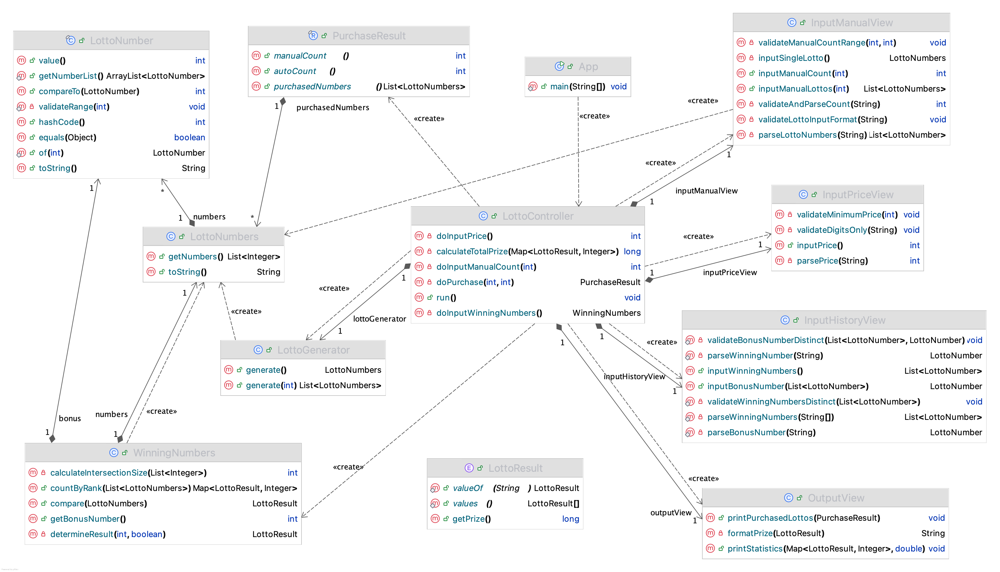

# Lotto-Simulator
> TDD 및 MVC 실습을 위한 과제입니다.

## Functional Requirements
- [x] 사용자가 구입 금액 입력 (개당 1000원)
- [x] 수동 구매 개수 입력
- [x] 남은 금액만큼 자동으로 구입 (랜덤 생성, 숫자 범위 1 ~ 45)
- [x] 지난주 당첨 번호 입력 (6개 + 보너스 번호 1개)
- [x] 구매한 로또 번호와 당첨 번호 비교
- [x] 당첨 통계 및 수익률 출력

## Programming Requirements
- [x] MVC 패턴 적용
- [x] JUnit5를 이용한 TDD 적용
- [x] indent depth는 1단계만 사용
- [x] else 키워드 미사용
- [x] 메서드 길이 최대 10줄
- [x] 배열 대신 ArrayList 사용
- [x] Enum 및 일급 컬렉션 사용
- [x] Collections의 shuffle() & sort() 메서드 사용
- [x] ArrayList의 contains() 메서드 사용

## Test Cases for TDD
<details>
<summary>JUnit5 Test Case</summary>
<br>

- LottoNumberTest
  * [x] 로또 번호는 1과 45가 허용된다.
  * [x] 로또 번호는 45 초과일 수 없다.
  * [x] 로또 번호는 1 미만일 수 없다.
- LottoNumbersTest
  * [x] 로또 번호는 비어있을 수 없다.
  * [x] 로또 번호를 구성하는 숫자는 1 미만일 수 없다.
  * [x] 로또 번호를 구성하는 숫자는 45 초과일 수 없다.
  * [x] 하나의 로또는 6개의 숫자로 구성되어야 한다.
  * [x] 로또 번호를 구성하는 숫자는 서로 중복될 수 없다.
- WinningNumbersTest
  * [x] 보너스 번호의 범위는 1부터 45까지 허용된다.
  * [x] 로또 번호는 보너스 번호를 포함하여 생성할 수 있다.
  * [x] 당첨 번호와 2개가 일치하면 당첨되지 않음으로 판정한다.
  * [x] 당첨 번호와 4개가 일치하면 4등으로 판정한다.
  * [x] 당첨 번호와 5개가 일치하고, 나머지 1개가 보너스 번호와 일치하면 2등으로 판정한다.
  * [x] 당첨 번호와 3개가 일치하면 5등으로 판정한다.
  * [x] 당첨 번호와 6개가 일치하면 1등으로 판정한다.
  * [x] 당첨 번호와 5개가 일치하면 3등으로 판정한다.
- LottoGeneratorTest
  * [x] 로또 번호 생성기는 1 ~ 45 범위의 중복 없는 6개 숫자를 생성한다.
  * [x] 로또 번호 생성기는 로또 당 6개의 숫자를 생성한다.
  * [x] 로또 번호 생성기는 0개 이상의 로또 번호를 생성한다.
  * [x] 로또 번호 생성기의 seed를 지정하면 결과가 재현 가능해야 한다.
  * [x] 로또 번호 생성기는 입력된 개수만큼 로또 번호를 생성한다.
- InputPriceViewTest
  * [x] 구입 금액은 숫자만 허용되고, 유효 값이 입력될 때까지 다시 입력 받는다.
  * [x] 구입 금액은 1000원 이상이어야 하고, 범위를 벗어나면 다시 입력 받는다.
- InputManualViewTest
  * [x] 수동 구매 개수는 최대 구매 개수를 넘을 수 없다.
  * [x] 수동 구매 개수가 0이면 빈 목록을 반환한다.
  * [x] 수동 구매 개수가 유효할 때까지 다시 입력 받는다.
  * [x] 수동 로또 번호는 유효할 때까지 다시 입력 받는다.
- InputHistoryViewTest
  * [x] 보너스 번호는 당첨 번호와 중복될 수 없다.
  * [x] 당첨 번호가 중복되면 다시 입력 받는다.
  * [x] 당첨 번호는 6개가 입력될 때까지 다시 입력 받는다.
  * [x] 보너스 번호는 숫자만 허용되며, 유효 값이 입력될 때까지 다시 입력 받는다.
  * [x] 당첨 번호가 범위를 벗어나면 다시 입력 받는다.
- OutputViewTest
  * [x] 당첨 통계 출력에 핵심 문구가 포함된다.

</details>
<br>

## Class Diagram


## Execution Results
```
구입금액을 입력해 주세요.
3000
수동으로 구매할 로또 수를 입력해 주세요.
1
수동으로 구매할 번호를 입력해 주세요.
1, 2, 3, 4, 5, 6
수동으로 1장, 자동으로 2개를 구매했습니다.
[1, 2, 3, 4, 5, 6]
[7, 8, 21, 27, 28, 44]
[5, 9, 23, 24, 25, 45]

지난 주 당첨 번호를 입력해 주세요.
1, 2, 3, 7, 8, 21
보너스 볼을 입력해 주세요.
5

당첨 통계
---------
3개 일치 (5,000원)- 2개
4개 일치 (50,000원)- 0개
5개 일치 (1,500,000원)- 0개
5개 일치, 보너스 볼 일치(30,000,000원) - 0개
6개 일치 (2,000,000,000원)- 0개
총 수익률은 3.33입니다.
```

## License
MIT License
